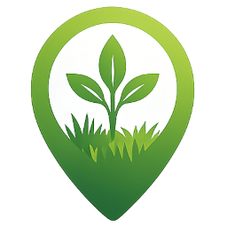

   
  

------------------------------------------------------------------------

PlantGo is a web application that encourages users to collect plant observations in the wild through a gamified system.

The app suggests species to look for based on species distribution model (SDM) predictions and the user’s location. It prioritizes plants with higher prediction uncertainty or limited observation data, helping users focus on observations that may be more informative.

Users can identify plants using the Pl@ntNet API. Each observation earns points depending on several factors, including:
- Whether the species was predicted in the area
- The distance to the closest existing record in GBIF
- The total number of observations of that species

------------------------------------------------------------------------
