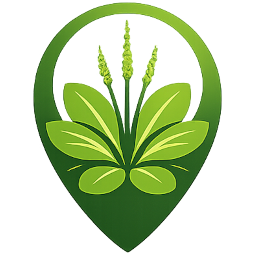

<p align="center">
  <br>
  
</p>

------------------------------------------------------------------------

PlantGo is a mobile-first web app that turns plant observation into a game — and steers players toward the observations that are most useful to science.

Species distribution models (SDMs) predict where plants should grow, but their predictions are uncertain and many species are under-recorded. PlantGo reads those predictions and generates **missions**: plants worth looking for in a specific zone near you, graded by how valuable a confirmed sighting would be. Players photograph a plant, it is identified with the [Pl@ntNet](https://plantnet.org) API, and the observation is scored — higher when it confirms an uncertain prediction, fills a gap in [GBIF](https://www.gbif.org) records, or documents a rarely observed species.

This repository is the **frontend**: a plain-JavaScript progressive web app served as static files, backed by Firebase (auth + Firestore) and the PlantGo backend API.

------------------------------------------------------------------------

## Table of contents

- [What the app does](#what-the-app-does)
- [How points work](#how-points-work)
- [Architecture](#architecture)
- [Project layout](#project-layout)
- [Firestore data model](#firestore-data-model)
- [Backend API](#backend-api)
- [Running locally](#running-locally)
- [Internationalisation](#internationalisation)
- [Conventions](#conventions)
- [Roadmap](#roadmap)

------------------------------------------------------------------------

## What the app does

### 🗺️ Mission map — the front page (`index.html`)

The map is the core of the app. On load it takes a GPS fix, centres on the player, and fetches missions for the visible area from `/api/v2/missions/map`. Each mission is a pin with:

- a **species** (scientific + vernacular name, Wikipedia thumbnail),
- a **zone** — a GeoJSON polygon the player has to be standing inside to complete it,
- a **grade** — `common` / `rare` / `epic` / `legendary`, shown as *Routine / Important / Major / Critical*,
- optionally a **probability raster** (GeoPl@ntNet tiles) painted behind the zone when the pin is tapped.

Pins that would overlap at the current zoom are merged into one cluster carrying the colour of its best mission. Panning far enough triggers a debounced refetch; every mission seen this session is kept (up to 600) so the sheet below the map always knows the full picture.

The bottom sheet has three tabs:

| Tab | What it shows | How it is computed |
|---|---|---|
| **Missions** | Missions whose zone contains the player *right now* | Local point-in-polygon test against every known zone, re-run on each GPS fix — no network request |
| **Around you** | Species most likely to be found at the player's position | One `/api/prediction` call; invalidated once the player walks > 400 m |
| **Challenge** | Leaderboard / species checklist of the active group challenge | Only appears while the player is in a challenge |

Tapping a pin or row opens a **species detail** screen in the sheet (a photo strip — the Wikipedia picture beside Pl@ntNet field photos badged by organ — chance of presence, description, trivia, Wikipedia/GBIF links) while the map keeps showing the zone and raster. An "What is this?" info sheet explains missions in plain language and links to [`mission-pipeline.html`](mission-pipeline.html), a long-form write-up of how missions are derived from SDM rasters.

### 📷 Identify & score

The camera button opens the device camera. The photo is resized client-side (≤ 1280 px), sent with the GPS fix to `/api/identify`, and a **result modal** walks through what happened:

1. Pl@ntNet identification (score < 0.2 → shown as tentative, **not saved**).
2. Base points from the backend, broken down by factor.
3. Bonus badges: mission accomplished, new species discovery, daily quest completed, achievement badges unlocked.
4. Animated level-progress bar and confetti on level-up.
5. Description and trivia, polled from the backend while it generates them.

### 🌿 Herbarium (`plantdex.html`)

Every species the player has discovered, with photo and common name. Tapping opens the same species sheet the map uses.

### 📜 Observations (`observations.html`)

Paginated history of every observation (20 per page, infinite scroll) with its score breakdown and bonuses, plus running totals.

### 🏅 Badges (`badges.html`)

17 achievement badges across six groups (observations, missions, discoveries, quests, rarity, level), each with a tier ring and progress bar. Older accounts are scanned once (`badgesRetroVersion`) so badges earned before the system existed are awarded retroactively.

### 🧠 Daily quiz (`quiz.html`)

Once per day, after observing **10 distinct species that day**, the player can take a 10-question quiz generated by the backend about those species. Each correct answer is worth 200 points. Questions are fetched in parallel after the first one lands.

### 🎯 Daily quests

Three quests reset every day, tracked live from today's observations and shown as a chip on the map:

| Quest | Goal |
|---|---|
| Daily observations | 10 observations |
| Relevé (inventory) | 5 different species within 50 m of each other |
| Mission | Complete 1 mission |

Each completion is worth **+1000** points. Completing the relevé quest unlocks the 🔬 badge; completing all three in a day unlocks 🌄 *Perfect day*.

### 🏁 Group challenges

A player creates a challenge (10–60 min), gets a 5-letter code, and friends join with it. Currently only **Species Hunt** is creatable: the creator picks a number of species from the local predictions and everyone races to find them. A **points race** type exists in the data layer but is switched off in the UI (`CREATABLE_TYPES` in `ChallengeModal.controller.js`). Leaderboards update in real time via Firestore subscriptions.

------------------------------------------------------------------------

## How points work

**Base points** are computed by the backend for each observation and returned as `points.total` with a `points.detail` breakdown:

| Key | Meaning |
|---|---|
| `points.baseObs` | Flat reward for any valid observation |
| `points.modelUncertainty` | Higher when the SDM is unsure the species is present here |
| `points.distance` | Higher when there are few GBIF records within 20 km |
| `points.numberObs` | Higher when the species is rarely observed on GBIF overall |

**Bonuses** are applied client-side in [`src/data/observations.js`](src/data/observations.js) and [`src/controllers/ResultModal.controller.js`](src/controllers/ResultModal.controller.js):

| Bonus | Points | Rule |
|---|---|---|
| New species discovery | +500 | First time this player observes the species |
| Mission accomplished | +500 / +750 / +1000 / +2000 | By grade (Routine → Critical); once per mission per day; player must be inside the zone |
| Daily quest completed | +1000 each | See quests above |
| Quiz | +200 per correct answer | Once per day |

**Anti-farming:** the same species observed within **100 m** of a same-day observation is a *nearby duplicate* — it is saved, but earns only `points.baseObs` and no discovery bonus.

**Levels:** `level = 1 + floor(total_points / 11000)`. Levels 5, 10 and 20 unlock badges.

**Challenges** score on base points only (points race) or on species matched (species hunt) — bonuses never count.

------------------------------------------------------------------------

## Architecture

No framework, no bundler, no build step. Everything is native ES modules loaded straight from the HTML files; Firebase and Leaflet come from CDNs.

```
HTML page  →  src/pages/*.app.js   (bootstrap: i18n, header, auth guard, mount)
                    │
                    ▼
            src/controllers/*      (behaviour, orchestration, state)
              │             │
              ▼             ▼
   src/ui/components/*    src/data/*         src/api/plantgo.js
   (pure DOM views)       (Firestore repos,  (PlantGo backend
                           geo, wiki, GBIF)   HTTP client)
```

- **Pages** (`src/pages/`) initialise i18n, build the shared `Header`, guard on `onAuthStateChanged`, and mount one root controller.
- **Controllers** own state and wire views to data. They return a DOM element (or an object with `element` plus lifecycle methods like `start()` / `stop()`).
- **Views** (`src/ui/components/`) create DOM, expose setters and `on…` hooks, and never touch Firestore or the API.
- **Data** (`src/data/`) wraps Firestore reads/writes and external services (Wikipedia thumbnails, GBIF vernacular names, geolocation). Wikipedia and GBIF lookups are cached in `localStorage` with a TTL.
- **API** (`src/api/`) is a single thin `fetch` client; endpoints are defined in [`src/api/config.js`](src/api/config.js).

Realtime state (level, badges, daily quests, mission completions, challenge leaderboard) comes from Firestore `onSnapshot` subscriptions rather than polling, so an observation made on the map greys out its pin without a reload.

Two stylesheets are loaded: `assets/styles.css` (v1, still used by a few components such as the identify panel and result modal internals) and `assets/styles.v2.css` (the current design system, loaded second so it wins).

------------------------------------------------------------------------

## Project layout

```
plantgo-v2/
├── index.html              Front page — the mission map
├── plantdex.html           Herbarium
├── observations.html       Observation history
├── badges.html             Badges
├── quiz.html               Daily quiz
├── login.html / login.js   Email + password sign-in
├── signup.html / signup.js Account creation (creates users/{uid})
├── old_home.html           Legacy home (missions list + quests); reachable by URL only
├── map.html                Redirect stub → index.html
├── mission-pipeline.html   Standalone explainer: from SDM raster to mission
├── manifest.json           PWA manifest (installable, standalone, portrait)
├── firebase-config.js      Firebase app / Firestore / Auth init
├── assets/                 Logos, backgrounds, icons, styles.css, styles.v2.css
└── src/
    ├── api/                config.js (endpoints), plantgo.js (HTTP client, image resize)
    ├── pages/              One *.app.js bootstrap per HTML page
    ├── controllers/        MapPage, MissionMap, IdentifyPanel, ResultModal, Quiz, …
    ├── ui/
    │   ├── components/     Views (*.view.js), Modal, SpeciesSheet, LocationGate
    │   ├── levelProgress.js  Level maths, progress animation, confetti
    │   └── navHeight.js
    ├── data/               Firestore repos + services (see below)
    ├── language/           i18n.js + en/fr/de/it/es/pt.json
    └── user/level.js       Live level subscription
```

Key data modules:

| File | Responsibility |
|---|---|
| `observations.js` | Save an observation, discovery, bonuses, counters, challenge scoring |
| `missions.repo.js` | Mission bonus tiers; persist "missions I'm standing in" for scoring |
| `missionsDone.js` | Per-day record of accomplished missions |
| `extent.geo.js` | Point-in-polygon test for mission zones |
| `dailyQuests.js` | Quest progress + completion awards |
| `badges.js` | Badge definitions, unlock logic, retroactive scan |
| `challenges.js` / `activeChallenge.js` | Create/join challenges, leaderboard, live active-challenge state |
| `geo.service.js` | `getCurrentPosition`, `watchPosition` (drops fixes < 8 m), permission watcher |
| `wiki.service.js` / `vernacular.service.js` | Wikipedia thumbnails & summaries, GBIF common names |

------------------------------------------------------------------------

## Firestore data model

```
users/{uid}
  name, email, total_points, total_observations,
  total_mission_observations, total_discoveries,
  missions_here[]        missions the player is currently inside (written by the map)
  missions_list[]        legacy area cache (old home page)
  activeChallenge        { id, code, type, endAt } | null
  quiz_last_date         "YYYY-MM-DD"
  badgesRetroVersion

users/{uid}/observations/{autoId}
  speciesName, gbif_id, vernacularName, observedAt, location (GeoPoint),
  plantnetImageCode, plantnet_identify_score,
  total_points, points{...detail}, bonus{ discovery, mission }, nearbyDuplicate?

users/{uid}/discoveries/{speciesName}
  discoveredAt, location, observationId, gbif_id, vernacularName

users/{uid}/badges/{badgeId}                  unlockedAt
users/{uid}/dailyQuestCompletions/{YYYY-MM-DD} completedIds[]
users/{uid}/missionCompletions/{YYYY-MM-DD}    missionIds[]

challenges/{id}
  code, type ("points" | "species_hunt"), createdBy, endAt, speciesList[]
challenges/{id}/members/{uid}
  username, score, foundSpecies[], foundGbifIds[]
```

------------------------------------------------------------------------

## Backend API

Base URL is set in [`src/api/config.js`](src/api/config.js) (`API_BASE_URL`). The backend lives in the sibling `plantgo_backend_server` repository.

| Endpoint | Used for |
|---|---|
| `POST /api/identify` | Pl@ntNet identification + scoring (multipart: `image`, `lat`, `lon`, `model`, `lang`) |
| `GET /api/v2/missions/map` | Mission pins + zones for a radius around a point |
| `GET /api/missions/{id}` | Mission detail: metrics, description, trivia |
| `POST /api/prediction` | Species predicted around a point ("Around you", Species Hunt) |
| `GET /api/sdm/available_models` | SDM models available at a location |
| `POST /api/description/{gbif_id}` | Species description + habitat (cached-or-null; generated in background) |
| `POST /api/trivia/{gbif_id}` | Species trivia (same async pattern) |
| `GET /api/species/{gbif_id}/images` | Photo gallery: up to 12 organ-balanced Pl@ntNet photos (author, licence, thumb/medium/full URLs), served from the backend's cache |
| `POST /api/quiz` | Quiz questions for a list of species |
| `POST /api/missions` | Legacy missions list (old home page) |

Probability rasters are Leaflet tile layers fetched directly from GeoPl@ntNet (`GPN_TILE_BASE`); the mission id encodes the area and raster id, so no extra request is needed.

------------------------------------------------------------------------

## Running locally

There is nothing to install or build. Serve the folder over HTTP (ES modules and geolocation do not work from `file://`):

```bash
# any static server works
python3 -m http.server 5500
# or the VS Code Live Server extension (configured on port 5500 in .vscode/settings.json)
```

Then open `http://localhost:5500/login.html`.

To point at a local backend, switch `API_BASE_URL` in `src/api/config.js`:

```js
export const API_BASE_URL = "http://localhost:8111/api/";
```

**Geolocation** requires a secure context — `localhost` is fine, but testing on a phone over LAN needs HTTPS or a tunnel.

**Debug mode** (header menu → Settings) adds `debug=true` to identify requests and shows timings and raw responses in the result modal.

Script and stylesheet URLs carry a `?v=…` query string for cache busting; bump it when shipping changes to those files.

------------------------------------------------------------------------

## Internationalisation

Six languages: `en`, `fr`, `de`, `it`, `es`, `pt`. Dictionaries live in [`src/language/`](src/language/); `en.json` is the reference.

- `t("key", { var })` for strings built in JS.
- `data-i18n`, `data-i18n-placeholder`, `data-i18n-title` attributes for static markup, translated by `translateDom()`.
- The chosen language is stored in `localStorage.lang`, applied to `<html lang>`, and sent to the backend so names, descriptions, trivia and quiz questions come back translated.
- Changing language dispatches `i18n:changed`; controllers listen and re-render.

------------------------------------------------------------------------

## Conventions

- **Coordinates** are `{ lat, lon }` everywhere except GeoJSON, which is `[lon, lat]`; the conversion happens once in `extent.geo.js`.
- **Daily keys** are local-calendar `YYYY-MM-DD` strings (`todayKey()`), shared by quests, quizzes and mission completions.
- **Subscriptions** return a teardown function; controllers expose `stop()` and pages call it on logout.
- **Firestore writes** that can race (mission completion, quest completion) use `arrayUnion` / `increment` rather than read-then-write.
- Views are named `*.view.js` and build the markup; controllers hold state and wiring (the one exception is `ChallengeModal`, which renders its own form inside a `Modal`).

------------------------------------------------------------------------

## Roadmap

See [`TODO.md`](TODO.md) for the current task list, known issues and planned features.
